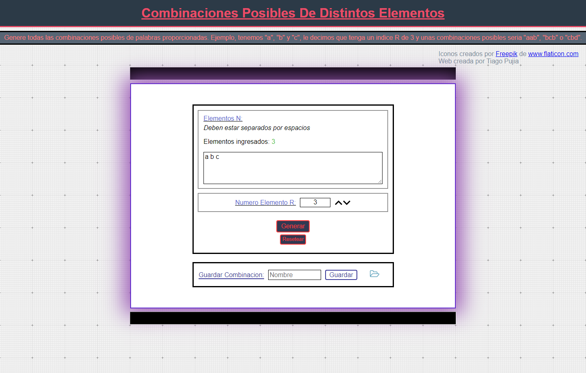
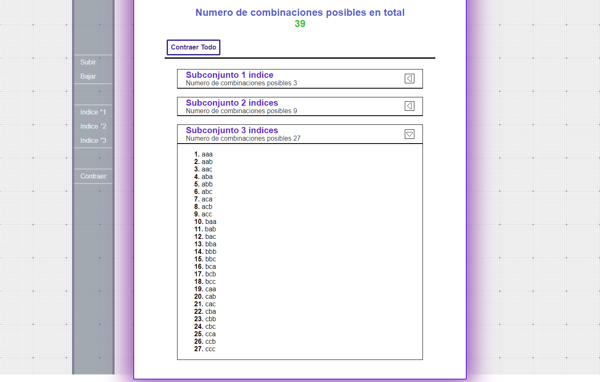

# Función
Generate all possible combinations of X given words. Example, we have "a", "b" and "c", we tell it to have an R index of 3, the possible combinations would be "aab", "bcb", "cbd", "bbc", etc ...

## Note
The project began at a stage where there was still no knowledge about Git and little programming, so there are no logs.